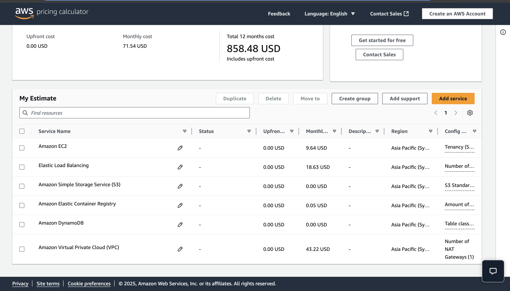

# Spring Boot Hello App on AWS (Terraform + Docker)

This project is a complete infrastructure and application deployment that:
- Builds and packages a SpringBoot app with a '/hello' endpoint returning '200 OK'.
- Packages the app using Docker, pushes it to AWS ECR
- Provisions AWS infrastructure with Terraform
- Deploys app to EC2 (via Auto Scaling Group) in a private Subnet, fronted by a public LB.

---


# Project Structure

```
.
├── src/main/java                   # Spring Boot Java source code
├── Dockerfile                      # Builds the Spring Boot JAR into a Docker image
├── terraform/
│   ├── main.tf                     # EC2 Launch Template, Auto Scaling Group
│   └── vpc.tf                      # VPC and subnet configurations
│   ├── alb.tf                      # Application Load Balancer & Target Group
│   ├── ec2_sg.tf                   # Security Groups for ALB and EC2
│   ├── iam.tf                      # IAM role for EC2 to pull ECR images and enable SSM for EC2 access
│   ├── output.tf                   # Terraform output values (e.g., ALB default URL)
│   ├── variables.tf                # variables declaration
│   └── user_data.sh.tpl            # script to pull and run Docker container

```

---

## URL

Once deployed, app is accessible at:

```
http://<alb_dns_name>/hello
```

Example:
```
http://web-app-alb-369283590.ap-southeast-2.elb.amazonaws.com/hello
```

Returns:
```
OK
```

---

## How to Test

1. Open the ALB URL in your browser:  
   You’ll see `OK` if it's healthy.

2. From terminal:
   ```bash
   curl http://<alb_dns_name>/hello
   ```
## Cost Estimation
